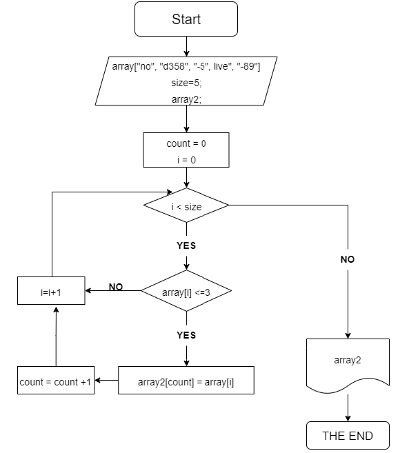

# **Решение задачи**

1. Объявляем два массива строк одинаковой длины
2. Создаем метод, в качестве аргументов используем заданные массивы 
3. Через цикл *for* проходим по всемй длине нашего массива 
4. Проверяем каждый элемент массива через *if*, длина эллемента меньше либо равна 3
5. Если условие выполняется записывыем элемент с этим индексом в пустой массив
6. Выводим результат на экран

